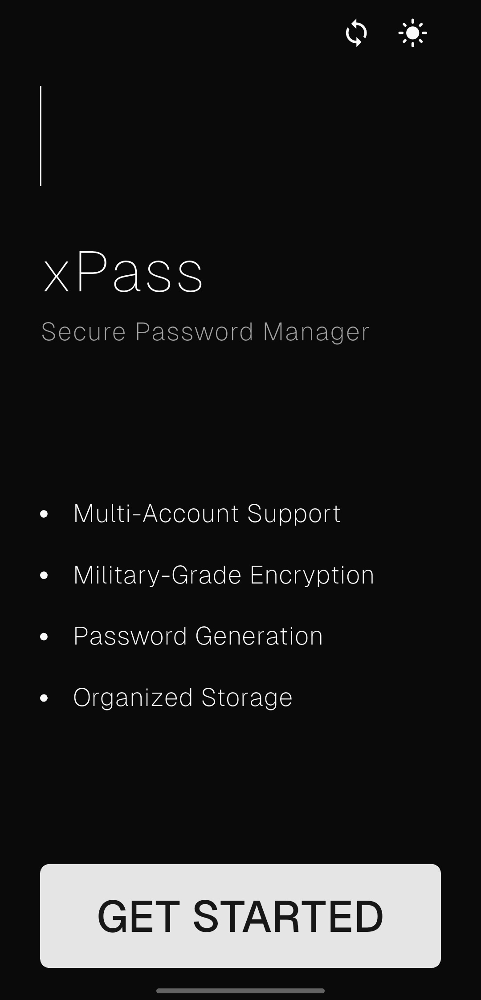
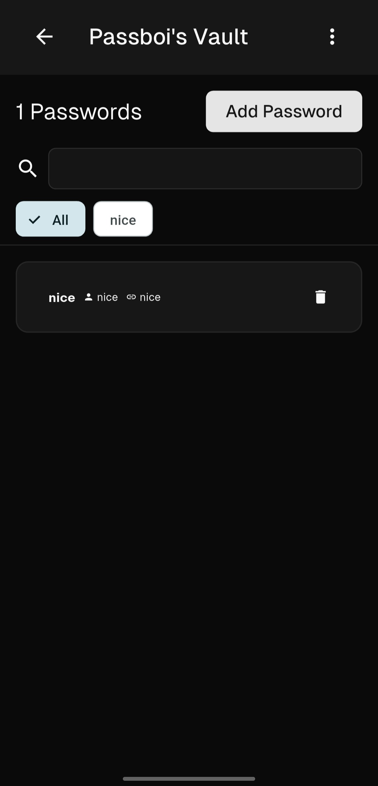
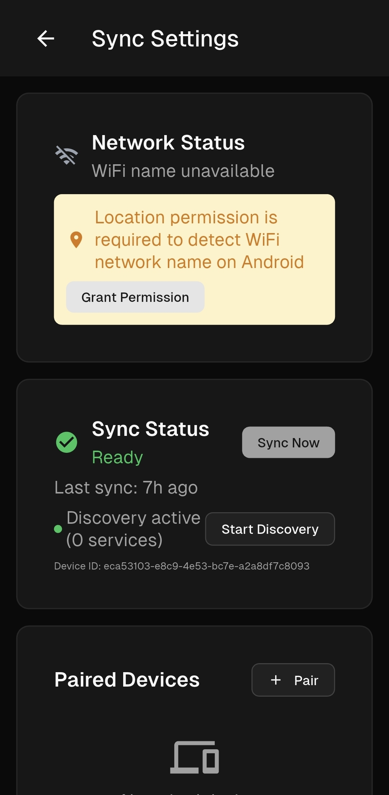
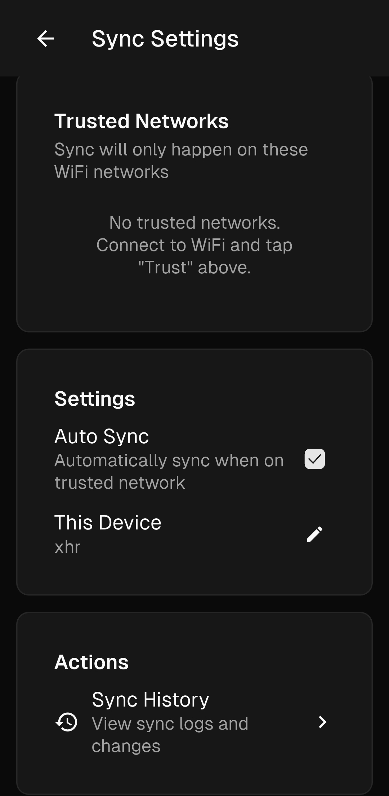

# xPass - Enterprise-Grade Password Management Solution

[](https://github.com/DhruvParmar10/xPass/releases)
[](https://flutter.dev)
[](https://dart.dev)
[](LICENSE)
[](https://keepass.info/help/base/security.html)
[](https://flutter.dev/multi-platform)

A cross-platform password manager engineered with Flutter that implements industry-standard encryption protocols using the KDBX format. Architected for enterprise security requirements with comprehensive multi-tenant support, automated data import workflows, secure password generation capabilities, and intelligent peer-to-peer synchronization across trusted networks.

## Screenshots

<div align="center">
  
  
  <p><em>Intuitive home interface and secure password vault with organized entry management</em></p>
</div>

## Advanced Technical Implementation

The application demonstrates sophisticated Flutter development patterns and security engineering:

- **KDBX Cryptographic Storage**: Implements the battle-tested [KDBX library](https://pub.dev/packages/kdbx) for KeePass-compatible encrypted databases with AES-256-CBC encryption and PBKDF2 key derivation
- **Multi-Tenant Architecture**: Engineered with complete tenant isolation, featuring segregated encrypted data stores and independent security contexts per account
- **Zero-Configuration Network Synchronization**: Privacy-first peer-to-peer sync system utilizing mDNS service discovery ([nsd](https://pub.dev/packages/nsd)) for automatic device detection on trusted networks, with QR code-based pairing ([qr_flutter](https://pub.dev/packages/qr_flutter), [mobile_scanner](https://pub.dev/packages/mobile_scanner)) and intelligent conflict resolution algorithms
- **Trusted Network Intelligence**: Advanced network monitoring via [network_info_plus](https://pub.dev/packages/network_info_plus) with WiFi SSID-based trusted network detection and automatic sync triggering when devices join pre-configured secure networks
- **Secure Device Pairing Protocol**: One-time QR code authentication system with cryptographic device fingerprinting using [uuid](https://pub.dev/packages/uuid) and [device_info_plus](https://pub.dev/packages/device_info_plus), eliminating manual configuration while maintaining security boundaries
- **Asynchronous State Management**: Leverages Flutter's reactive architecture with proper async/await patterns, Future-based operations, and comprehensive error propagation
- **Cross-Platform File System Abstraction**: Implements unified file operations across platforms using [path_provider](https://pub.dev/packages/path_provider) with secure local persistence strategies
- **Enterprise Data Migration**: Production-grade CSV import and export engine with intelligent header mapping, data validation, and transactional operations via [csv](https://pub.dev/packages/csv)
- **Secure Password Generation**: Built-in cryptographically secure password generator with configurable length and character sets
- **Security-First Permission Model**: Runtime permission orchestration using [permission_handler](https://pub.dev/packages/permission_handler) with granular Android storage access controls
- **Cryptographic Utilities**: Extends security capabilities through Dart's [crypto](https://pub.dev/packages/crypto) library for additional hash operations and secure random generation
- **Universal File Access**: Cross-platform file selection interface via [file_picker](https://pub.dev/packages/file_picker) with MIME type validation and security filtering
- **Background Sync Infrastructure**: Optional background synchronization using [flutter_secure_storage](https://pub.dev/packages/flutter_secure_storage) for encrypted master password persistence, enabling seamless sync operations without user intervention

## Advanced Engineering Patterns

- **Reactive UI Architecture**: Sophisticated widget composition using `StatefulBuilder`, `FutureBuilder`, and custom state management patterns with proper disposal lifecycle
- **Responsive Layout Engineering**: Advanced constraint-based layouts leveraging `ConstrainedBox`, `Flexible`, and `Expanded` widgets with overflow prevention strategies
- **Modal Dialog Architecture**: Complex nested dialog systems with isolated state management, form validation, and error boundary implementation
- **Material Design 3.0 Implementation**: Modern UI patterns using [shadcn_flutter](https://pub.dev/packages/shadcn_flutter) component library with advanced theming, elevation models, and typography scaling
- **Mesh Synchronization Topology**: Distributed sync architecture enabling full-mesh device communication where any paired device can sync with any other on trusted networks, with intelligent merge conflict resolution and rollback capabilities
- **Memory Security Protocols**: Implements secure memory handling with `ProtectedValue` encryption for sensitive data and proper garbage collection
- **Defensive Programming**: Comprehensive exception handling with graceful degradation, user feedback systems, and audit logging capabilities
- **Platform Adaptation Layer**: Conditional platform-specific implementations for iOS Keychain, Android KeyStore, and desktop file system integration

## Production Dependencies

**Core Security & Storage:**

- [kdbx ^2.4.1](https://pub.dev/packages/kdbx) - Industry-standard KeePass database implementation with AES encryption
- [crypto ^3.0.3](https://pub.dev/packages/crypto) - Cryptographic primitives and secure hash functions
- [flutter_secure_storage ^9.2.2](https://pub.dev/packages/flutter_secure_storage) - Hardware-backed encrypted storage for sensitive credentials
- [shared_preferences ^2.2.3](https://pub.dev/packages/shared_preferences) - Persistent key-value storage abstraction

**Network Synchronization:**

- [nsd ^4.0.3](https://pub.dev/packages/nsd) - mDNS/Bonjour service discovery for zero-configuration device detection
- [network_info_plus ^5.0.3](https://pub.dev/packages/network_info_plus) - Network interface monitoring and WiFi SSID detection
- [qr_flutter ^4.1.0](https://pub.dev/packages/qr_flutter) - QR code generation for secure device pairing
- [mobile_scanner ^5.1.1](https://pub.dev/packages/mobile_scanner) - High-performance QR code scanning with camera integration
- [device_info_plus ^10.1.0](https://pub.dev/packages/device_info_plus) - Device identification and hardware capability detection
- [uuid ^4.2.2](https://pub.dev/packages/uuid) - Cryptographically secure unique identifier generation

**File System & Permissions:**

- [file_picker ^10.3.3](https://pub.dev/packages/file_picker) - Native file system integration with security filtering
- [path_provider ^2.1.2](https://pub.dev/packages/path_provider) - Platform-abstracted directory access with sandboxing support
- [permission_handler ^11.3.1](https://pub.dev/packages/permission_handler) - Runtime permission management with compliance tracking

**Data Import & UI:**

- [csv ^6.0.0](https://pub.dev/packages/csv) - RFC 4180 compliant CSV processing with encoding detection
- [shadcn_flutter ^0.0.46](https://pub.dev/packages/shadcn_flutter) - Modern component library with comprehensive theming support
- [cupertino_icons ^1.0.8](https://pub.dev/packages/cupertino_icons) - iOS-style iconography

## Enterprise Architecture

```
xpassboi/
├── android/                 # Android platform bindings and security configuration
├── ios/                     # iOS platform integration with Keychain services
├── linux/                   # Linux desktop environment with D-Bus integration
├── macos/                   # macOS platform with Keychain and sandbox compliance
├── windows/                 # Windows platform with Credential Manager integration
├── lib/
│   ├── main.dart           # Application entry point with theme management
│   ├── models/             # Data models and domain entities
│   │   └── sync/           # Sync-specific models (devices, networks, logs)
│   ├── screens/            # Presentation layer with shadcn_flutter components
│   │   ├── home_screen.dart
│   │   ├── vault_screen.dart
│   │   ├── account_management_screen.dart
│   │   └── sync/           # Sync UI screens (pairing, settings, logs)
│   └── services/           # Business logic layer with security abstractions
│       ├── account_service.dart
│       ├── kdbx_service.dart
│       ├── theme_service.dart
│       ├── secure_storage_service.dart
│       └── sync/           # Sync orchestration services
│           ├── sync_manager.dart
│           ├── network_monitor.dart
│           ├── discovery_service.dart
│           ├── pairing_service.dart
│           └── sync_engine.dart
├── test/                   # Comprehensive unit, widget, and integration test suites
└── build/                  # Distribution artifacts and platform-specific binaries
```

**Architecture Overview:**

- [`lib/main.dart`](lib/main.dart) - Application bootstrap with theme management, shared preferences initialization, and root widget configuration
- [`lib/models/`](lib/models/) - Domain models including sync entities for paired devices, trusted networks, and synchronization state
- [`lib/screens/`](lib/screens/) - Presentation layer implementing Material Design 3.0 specifications with responsive layouts and accessibility compliance
- [`lib/services/`](lib/services/) - Business logic tier featuring cryptographic operations, data persistence, and security policy enforcement
- [`lib/services/sync/`](lib/services/sync/) - Distributed synchronization subsystem with network discovery, pairing protocols, and merge conflict resolution
- Platform directories - Native platform integrations with OS-specific security services, file system access, and hardware security module support

The application follows clean architecture principles with strict separation of concerns between the presentation layer ([`lib/screens/`](lib/screens/)), domain models ([`lib/models/`](lib/models/)), and business logic ([`lib/services/`](lib/services/)). All cryptographic operations are isolated within the service layer, ensuring security boundaries and facilitating security audits. The sync subsystem operates as a self-contained module with clear interfaces for network monitoring, device discovery, and vault synchronization.

## Sync Features in Action

<div align="center">
  
  
  <p><em>Seamless QR code-based device pairing and intelligent sync management across trusted networks</em></p>
</div>

## Contributing

We welcome contributions from the community! xPass is an open-source project and we appreciate your help in making it better.

### How to Contribute

1. **Fork the Repository** - Start by forking the [xPass repository](https://github.com/DhruvParmar10/xPass) to your GitHub account
2. **Clone Your Fork** - Clone the forked repository to your local development environment
3. **Create a Feature Branch** - Create a new branch for your feature or bug fix (`git checkout -b feature/your-feature-name`)
4. **Make Your Changes** - Implement your changes following our coding standards and architecture patterns
5. **Test Thoroughly** - Ensure all existing tests pass and add new tests for your changes
6. **Commit Your Changes** - Write clear, descriptive commit messages following conventional commit standards
7. **Push to Your Fork** - Push your changes to your forked repository
8. **Submit a Pull Request** - Open a pull request to the main repository with a detailed description of your changes

### Development Guidelines

- **Code Quality**: Follow Flutter/Dart best practices and maintain consistency with existing code style
- **Architecture**: Respect the clean architecture principles and separation of concerns
- **Security**: All security-related changes require thorough review and testing
- **Documentation**: Update documentation for any new features or significant changes
- **Testing**: Write unit tests for business logic and widget tests for UI components
- **Performance**: Consider performance implications, especially for cryptographic operations

### Areas for Contribution

- **Bug Fixes** - Report and fix issues in existing functionality
- **New Features** - Propose and implement new features (please open an issue first for discussion)
- **Documentation** - Improve documentation, add examples, or write tutorials
- **UI/UX Improvements** - Enhance the user interface and user experience
- **Security Enhancements** - Strengthen security measures and encryption protocols
- **Testing** - Expand test coverage and improve test quality
- **Localization** - Add support for additional languages
- **Performance** - Optimize performance and reduce resource usage

### Code of Conduct

We are committed to providing a welcoming and inclusive environment for all contributors. Please be respectful and professional in all interactions.

### Questions or Ideas?

- **Issues**: [GitHub Issues](https://github.com/DhruvParmar10/xPass/issues) - Report bugs or request features
- **Discussions**: [GitHub Discussions](https://github.com/DhruvParmar10/xPass/discussions) - Ask questions or share ideas

### License

By contributing to xPass, you agree that your contributions will be licensed under the Apache License 2.0.

---

**Made with ❤️ by the xPass community**
